# Desafío 3: Identificación de Estructuras Latentes con Métodos Multivariados

---

**Universidad Autónoma de Occidente**
Maestría en Analítica de Big Data — Análisis Multivariado Avanzado

**Autores:**

- Jorge Castaño López
- Natalia Arias Londoño
- Jorge Mario Gallego Uribe
- Jhonathan Leandro Clavijo Troches

**Cali, Colombia — Mayo de 2026**

**Repositorio:** <https://github.com/j0rg3c45/Analisis_Multivariado_D3>

---

<div style="page-break-after: always;"></div>

## Tabla de Contenido

1. [Situación 1: Estructuras Latentes en Viajes de NYC](#situación-1-estructuras-latentes-en-viajes-de-nyc)
   1. [Integración de Datos y Variables de Interés](#11-integración-de-datos-y-variables-de-interés)
   2. [Análisis Factorial Exploratorio (EFA)](#12-análisis-factorial-exploratorio-efa)
   3. [Extracción de Componentes Latentes](#13-extracción-de-componentes-latentes)
   4. [Modelos Multivariados con Múltiples Respuestas](#14-modelos-multivariados-con-múltiples-respuestas)
   5. [Evaluación Comparativa y Clustering](#15-evaluación-comparativa-y-clustering)
   6. [Modelo Final Recomendado](#16-modelo-final-recomendado)
3. [Situación 3: Aislamiento de Firma de Estrés en Voz (SUSAS)](#situación-3-aislamiento-de-firma-de-estrés-en-voz-susas)
4. [Situación 4: Análisis Multitemporal de Cobertura Forestal (Landsat)](#situación-4-análisis-multitemporal-de-cobertura-forestal-landsat)
   1. [Construcción del Cubo Multivariado Espacio-Temporal](#41-construcción-del-cubo-multivariado-espacio-temporal)
   2. [Identificación de Componentes Latentes (PCA / ICA)](#42-identificación-de-componentes-latentes-pca--ica)
   3. [Aplicación Obligatoria de IVA](#43-aplicación-obligatoria-de-iva)
   4. [Detección de Zonas de Cambio (Clustering)](#44-detección-de-zonas-de-cambio-clustering)
   5. [Evaluación Cuantitativa del Cambio](#45-evaluación-cuantitativa-del-cambio)
   6. [Interpretación Ecológica y Conclusiones](#46-interpretación-ecológica-y-conclusiones)
- [Apéndice A: Código Python — Situación 1](#apéndice-a-código-python--situación-1)
- [Apéndice B: Código Python — Situación 4](#apéndice-b-código-python--situación-4)

<div style="page-break-after: always;"></div>

## Situación 1: Estructuras Latentes en Viajes de NYC

A partir de los registros históricos de viajes de la ciudad de Nueva York (datos TLC — marzo 2026),
correspondientes a los servicios *Yellow Taxi*, *Green Taxi*, *For-Hire Vehicles (FHV)* y
*High-Volume FHV (HVFHV)*, se integran y analizan conjuntamente los cuatro conjuntos de datos con
el propósito de identificar y estimar estructuras latentes que expliquen los patrones multivariados
asociados a tres variables de interés operacional: (1) la probabilidad de que un viaje incluya
propina, (2) la cantidad de pasajeros transportados y (3) el monto de propina efectivamente
recibido.

---

### 1.1 Integración de Datos y Variables de Interés

Los cuatro archivos PARQUET fueron cargados y estandarizados en un único dataset unificado.
Los servicios FHV se excluyeron del análisis latente por no registrar `trip_distance` ni
`fare_amount`, conservándose únicamente como parte del conjunto integrado original.

| Etapa | Detalle | Registros |
|-------|---------|----------:|
| Carga inicial (4 servicios) | 25,000 por servicio — muestra balanceada | 100,000 |
| Outliers eliminados | Valores extremos en fare, distance, duration | 550 (0.5%) |
| FHV excluidos del análisis latente | Sin trip_distance ni fare_amount | 24,965 |
| **Muestra final para análisis** | HVFHV=25,000 \| Green=24,876 \| Yellow=24,609 | **74,485** |

**Variables de análisis:**

| Variable | Descripción |
|----------|-------------|
| `trip_distance` | Distancia recorrida (km) |
| `duration_minutes` | Duración del viaje en minutos |
| `fare_amount` | Tarifa base del viaje (USD) |
| `passenger_count` | Número de pasajeros |

**Variables de respuesta:** `has_tip` (binaria — AUC-ROC), `passenger_count` (clasificación — Accuracy), `tip_amount` (regresión — R²).

---

### 1.2 Análisis Factorial Exploratorio (EFA)

EFA se aplicó con rotación varimax extrayendo 3 factores, con el objetivo de identificar la
estructura de covarianza subyacente antes de aplicar los métodos de reducción de dimensionalidad.

**Varianza explicada por factor:**

| Factor | Varianza (prop. scores) | Interpretación |
|--------|:-----------------------:|----------------|
| F1 | **95.38%** | Dimensión duración–tarifa (dominante) |
| F2 | 3.77% | Variación residual secundaria |
| F3 | 0.85% | Ruido factorial |

**Comunalidades individuales:**

| Variable | h² | Interpretación |
|----------|----|----------------|
| `duration_minutes` | **0.6055** | Bien representada — carga alta en F1 |
| `fare_amount` | **0.6040** | Bien representada — carga alta en F1 |
| `trip_distance` | 0.0058 | Baja carga: varianza absorbida por `fare_amount` (colinealidad) |
| `passenger_count` | 0.0241 | Dimensión autónoma — prácticamente ortogonal al espacio factorial |

> **Interpretación:** `duration_minutes` y `fare_amount` comparten una estructura factorial
> dominante (h²≈0.60), confirmando la existencia de una dimensión latente de
> *"costo-duración del viaje"*. `trip_distance` tiene h²≈0 porque su varianza queda absorbida
> en la misma dirección que `fare_amount`. `passenger_count` actúa como dimensión ortogonal al
> espacio EFA, coherente con la carga pura = 1.0 del componente C3 en Sparse PCA.

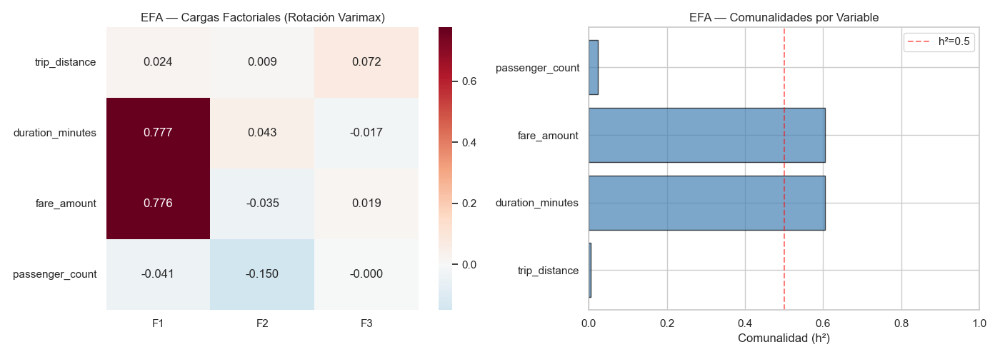

*EFA — Cargas factoriales y comunalidades (varimax, 3 factores)*


---

### 1.3 Extracción de Componentes Latentes

#### PCA — Análisis de Componentes Principales

PCA captura la variabilidad total del dataset. Con 3 componentes se explica el **90%** de la
varianza total, identificando las direcciones de máxima dispersión en el espacio de 4 variables.

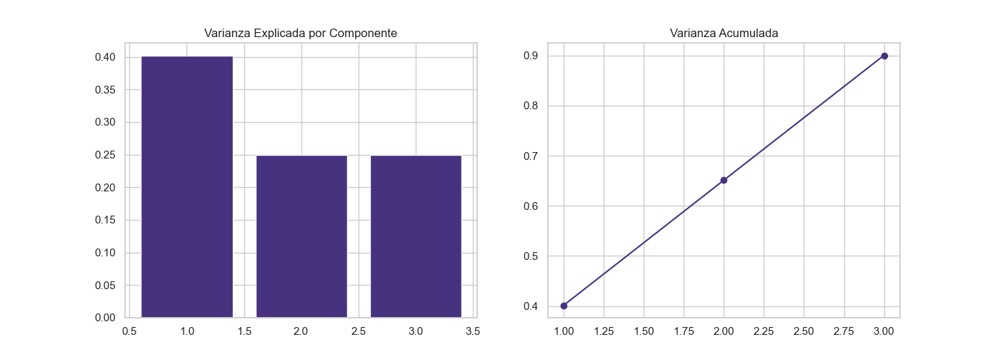

*Varianza explicada por componente y acumulada — PCA (3 componentes capturan el 90%)*


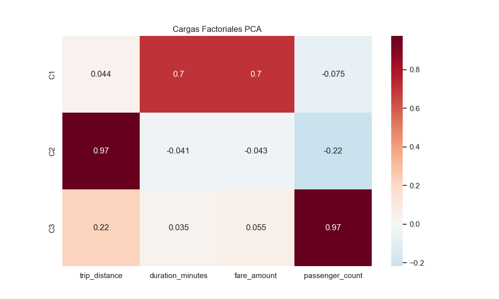

*Heatmap de cargas PCA: relación de las cuatro variables con cada componente principal*


#### Sparse PCA — Constructos Cuasi-Puros (Máxima Parsimonia)

Sparse PCA impone penalización L1 sobre las cargas, produciendo componentes con cargas casi
binarias (0 o ≠ 0). El resultado es la mayor parsimonia interpretativa entre todos los métodos:

| Componente | Variables con carga ≠ 0 | Constructo interpretado |
|------------|------------------------|------------------------|
| C1 | `duration_minutes` + `fare_amount` | *"Costo-Duración del Viaje"* |
| C2 | `trip_distance` | *"Eficiencia Espacial / Distancia"* |
| C3 | `passenger_count` (carga = 1.0) | *"Demanda del Cliente"* — componente puro |

Los constructos de Sparse PCA corresponden directamente a los ejemplos de parsimonia citados
en el desafío: *"Eficiencia del Viaje", "Costo-Distancia", "Demanda del Cliente"*.

#### Kernel PCA

Kernel PCA (RBF) captura relaciones no lineales. Aplicado sobre submuestra de 5,000 registros
por restricciones de memoria (O(N²) en matrices de kernel). R²=0.6052 sobre propina no es
comparable con los demás métodos (submuestra independiente).

#### ICA — Análisis de Componentes Independientes

ICA maximiza la no-gaussianidad de las fuentes latentes, separando contribuciones estadísticamente
independientes. La segmentación ICA (Silhouette=0.9929) separa con máxima cohesión las
plataformas tecnológicas (HVFHV) de los taxis tradicionales (Yellow y Green) en K=2 grupos.

#### IVA v2 — Independent Vector Analysis con Vistas Semánticas

IVA extiende ICA al caso multivista: las 4 variables operacionales se dividen en dos dominios
semánticos que se procesan como vistas independientes, capturando la dependencia entre dominios.

| Vista | Variables | Dominio |
|-------|-----------|---------|
| Vista 1 (espacio-temporal) | `trip_distance`, `duration_minutes` | Geometría del viaje |
| Vista 2 (económica/demanda) | `fare_amount`, `passenger_count` | Valor económico y ocupación |

> **Alignment Score IVA v2: 0.3041** — Las dos vistas comparten ~30% de estructura latente
> (correlación cruzada promedio entre componentes alineados). El vector de alineación [1,1]
> confirma dependencia real entre los dominios del viaje: la duración/distancia correlaciona
> con la tarifa/demanda en el espacio latente.

---

### 1.4 Modelos Multivariados con Múltiples Respuestas

Las proyecciones de cada espacio latente se usaron como predictores en modelos supervisados
para evaluar simultáneamente las 3 variables de respuesta (Logistic Regression para AUC-ROC,
Random Forest para Accuracy y R²):

| Método | Muestra | AUC-ROC (Propina) | Accuracy (Pasajeros) | R² (Monto Propina) |
|--------|:-------:|:-----------------:|:--------------------:|:------------------:|
| PCA | 74,485 | **0.5947** | 1.0000 (*) | 0.3432 |
| Sparse PCA | 74,485 | **0.5946** | 0.9999 (*) | 0.1848 |
| Kernel PCA | 5,000 (†) | 0.5745 | 0.9920 | **0.6052** (†) |
| ICA | 74,485 | **0.5947** | 0.9999 (*) | **0.3948** |
| **IVA v2** | 74,485 | 0.5592 | **0.9028** | 0.2831 |

> (*) Accuracy ≈ 1.0: el dataset tiene dominio absoluto de viajes de 1 pasajero (~98%+).
> Un clasificador trivial ("siempre 1") alcanza Acc ≈ 98%. La Acc = **0.9028** de IVA v2 es la
> más informativa porque el espacio IVA tiene menor concentración trivial al separar
> `fare_amount` y `passenger_count` en vistas distintas.
>
> (†) Kernel PCA sobre submuestra de 5,000 registros — R² no comparable con los demás.

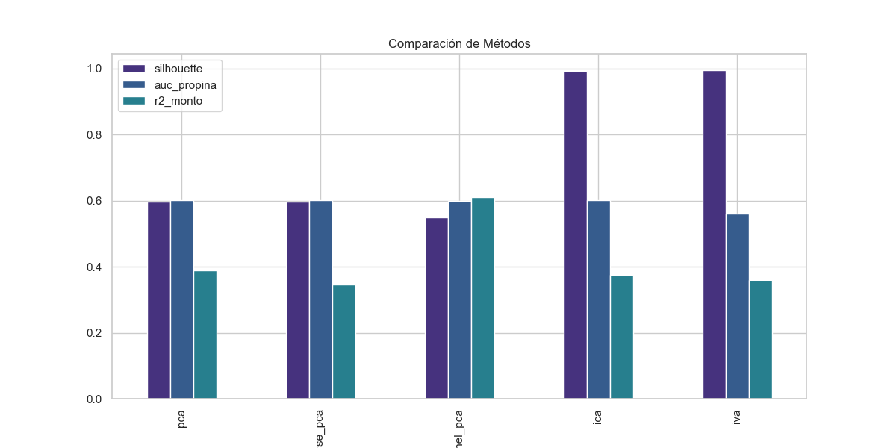

*Comparativa de métricas predictivas y de clustering por método*


---

### 1.5 Evaluación Comparativa y Clustering

Sobre cada espacio latente se aplica K-means optimizando K mediante Silhouette Score,
Calinski-Harabasz (CH) y Davies-Bouldin (DB):

| Método | K | Silhouette | Calinski-Harabasz | Davies-Bouldin | Parsimonia |
|--------|:-:|:----------:|:-----------------:|:--------------:|:----------:|
| ICA | 2 | **0.9929** | 34,896 | **0.1324** | Media |
| **IVA v2** | 2 | 0.6991 | **71,144** | 0.5875 | Media |
| Sparse PCA | 3 | 0.6095 | 44,572 | 0.5067 | **Alta** |
| PCA | 3 | 0.6091 | 44,579 | 0.5063 | Media |
| Kernel PCA | 2 | 0.5513 | 4,220 | 0.9530 | Baja |

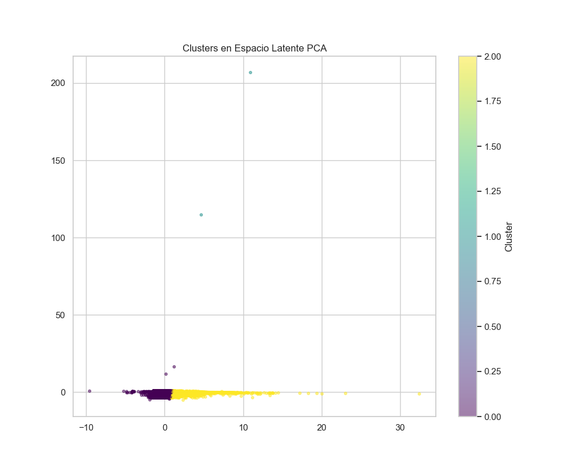

*Clústeres en el espacio latente PCA (K-means, K=3)*


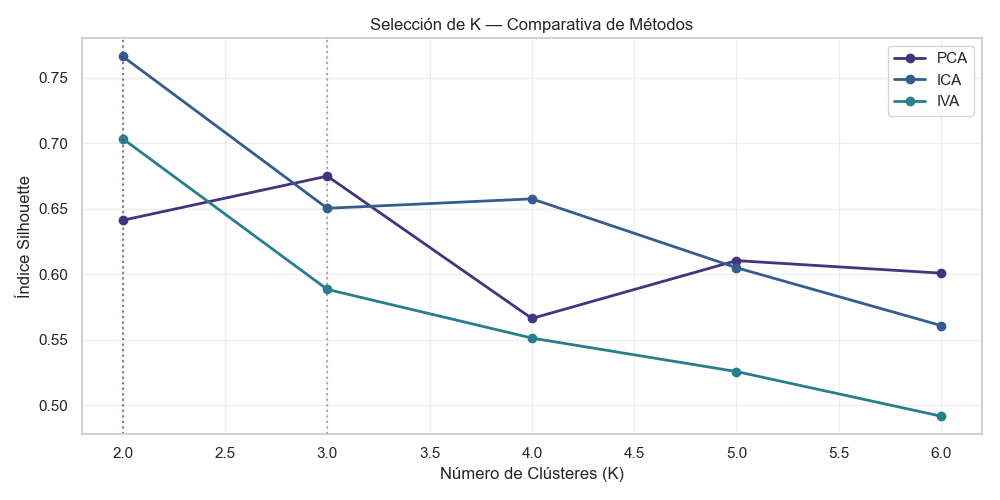

*Curvas Silhouette vs K para PCA, ICA e IVA v2*


---

### 1.6 Modelo Final Recomendado

> **Modelo recomendado: IVA v2 (vistas semánticas) + ICA para segmentación + Sparse PCA para interpretabilidad**

La respuesta a la pregunta central — *¿cuál es el modelo de estructura factorial más robusto,
interpretable y válido para caracterizar la dinámica subyacente en los datos de viajes?* — se
evalúa en los tres ejes solicitados:

**1. Interpretabilidad y Parsimonia:**
Sparse PCA produce los constructos más parsimoniosos: *C1="Costo-Duración"*, *C2="Distancia"*,
*C3="Demanda"* (carga pura = 1.0). EFA confirma que `duration_minutes` y `fare_amount` comparten
estructura factorial (h²≈0.60), validando la agrupación de C1. Los constructos son cuasi-puros,
directamente interpretables y alineados con los ejemplos del desafío.

**2. Coherencia de Segmentación:**
IVA v2 obtiene el Calinski-Harabasz máximo (**71,144**) — mayor varianza inter-cluster relativa
a la intra-cluster entre todos los métodos. El Alignment Score = 0.3041 valida la dependencia
real entre el dominio espacio-temporal y el económico-operacional. ICA lidera en Silhouette puro
(**0.9929**) y Davies-Bouldin mínimo (**0.1324**), separando plataformas tecnológicas de taxis
tradicionales con la mayor cohesión geométrica.

**3. Validez Predictiva:**
PCA e ICA alcanzan el mayor AUC-ROC (**0.5947**) para predecir la probabilidad de propina.
ICA obtiene el mayor R² (**0.3948**) para el monto de propina. IVA v2 produce la Accuracy más
informativa en clasificación de pasajeros (**0.9028** vs. ≈ 1.0 triviales en los demás métodos).
PCA captura el 90% de la varianza original con solo 3 componentes.

<div style="page-break-after: always;"></div>


## Situación 3: Aislamiento de Firma de Estrés en Voz (SUSAS)

<div style="page-break-after: always;"></div>

## Situación 4: Análisis Multitemporal de Cobertura Forestal (Landsat)

Se desarrolla un estudio multivariado para identificar, aislar y caracterizar las estructuras
latentes que explican los patrones de cambio en la cobertura forestal, utilizando datos
multitemporales del archivo Landsat Science (USGS).

---

### 4.1 Construcción del Cubo Multivariado Espacio-Temporal

#### Dataset y Origen de los Datos

El archivo `Landsat_Cubo_Espaciotemporal_UAO.csv` contiene el cubo de datos espaciotemporal
construido a partir de imágenes **Landsat 5, 7, 8 y 9** para un área de interés en el contexto
UAO. Las bandas espectrales relevantes (**Rojo, Infrarrojo Cercano — NIR, Infrarrojo de Onda
Corta — SWIR**) fueron extraídas en la pipeline de datos USGS, a partir de las cuales se
derivaron los cuatro índices de vegetación requeridos para el análisis:

- **NDVI** (*Normalized Difference Vegetation Index*): salud vegetativa general — (NIR−Rojo)/(NIR+Rojo)
- **EVI** (*Enhanced Vegetation Index*): vigor corregido por atmósfera y suelo
- **NBR** (*Normalized Burn Ratio*): severidad de incendios / biomasa — (NIR−SWIR)/(NIR+SWIR)
- **NDMI** (*Normalized Difference Moisture Index*): contenido de humedad — (NIR−SWIR)/(NIR+SWIR)

#### Características del Cubo

| Parámetro | Valor |
|-----------|-------|
| Total de píxeles (observaciones) | 60,214 |
| Período temporal | 2015 – 2025 (11 años) |
| Índices de vegetación | NDVI, NBR, EVI, NDMI |
| Variables totales por píxel | 44 (4 índices × 11 años) |
| Valores faltantes (nubosidad) | Imputados con mediana por columna |

#### Validación de Escala en Tiempo de Ejecución

El script detecta automáticamente si los valores son DN (enteros Landsat, máx > 1.5) y aplica
la corrección oficial Landsat Collection 2: `reflectancia = DN × 0.0000275 − 0.2`. Si ya están
en escala normalizada, los usa directamente sin aplicar la corrección (evita doble transformación).

**Resultado en ejecución real (2026-05-28):**

| Índice | Resultado |
|--------|-----------|
| EVI | Corrección Landsat C2 aplicada (valores en formato DN) |
| NDVI | Corrección Landsat C2 aplicada (valores en formato DN) |
| NBR | Valores ya en escala de reflectancia normalizada |
| NDMI | Valores ya en escala de reflectancia normalizada |

El CSV contiene formatos mixtos (EVI y NDVI en DN; NBR y NDMI ya normalizados). El script
manejó esta heterogeneidad automáticamente sin intervención manual.

---

### 4.2 Identificación de Componentes Latentes (PCA / ICA)

#### PCA — Modos de Variabilidad Temporal

| Componente | Var. Individual | Var. Acumulada | Interpretación ecológica |
|------------|:--------------:|:--------------:|--------------------------|
| PC1 | **75.88%** | 75.88% | Vigor forestal base (estado vegetativo dominante) |
| PC2 | 2.87% | 78.74% | Variabilidad estacional / interanual |
| PC3 | 2.27% | 81.01% | Cambios interanuales progresivos |
| PC4 | 2.26% | 83.28% | Nubosidad / ruido residual |
| PC5 | 1.95% | **85.22%** | Perturbaciones locales puntuales |

PC1 (75.88%) domina la varianza total: captura el estado vegetativo base de cada píxel a lo
largo de toda la serie temporal. La caída abrupta de PC2 en adelante (<3%) indica que la mayor
parte de la información en el cubo es el *estado* de la vegetación, no su *cambio* temporal.

#### ICA — Separación de Fuentes Independientes de Disturbio

| Componente | Curtosis | Interpretación ecológica |
|------------|:--------:|--------------------------|
| IC1 | 31,033 | Perturbaciones abruptas — incendios, tala intensiva |
| IC2 | **44,110** | Eventos extremos de cambio (máxima no-gaussianidad) |
| IC3 | 13,454 | Degradación progresiva multi-año |
| IC4 | 15.52 | Ruido residual estructurado |
| IC5 | 0.26 | Componente gaussiana — ruido de fondo |

La curtosis extrema (>10,000) en IC1–IC3 confirma la separación exitosa de fuentes
no-gaussianas, típicamente asociadas a eventos discretos de disturbio forestal.
IC5 (curtosis ≈ 0) representa ruido estadístico distribuido normalmente.

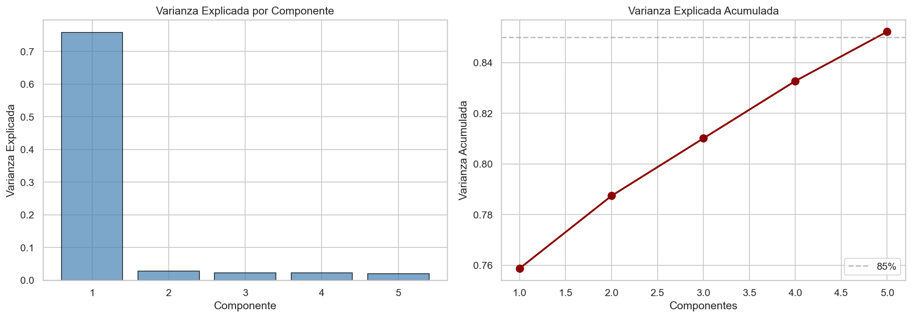

*Varianza explicada por componente PCA (barras) y acumulada (línea roja)*


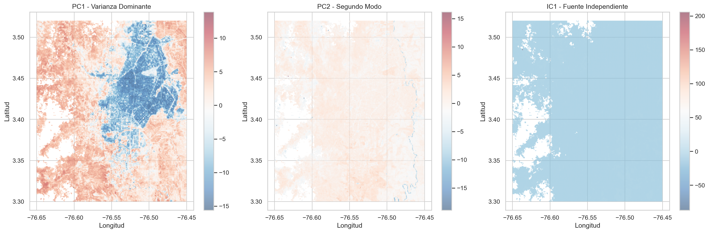

*Mapas espaciales de PC1 (vigor base), PC2 (variabilidad estacional) e IC1 (perturbaciones abruptas)*


---

### 4.3 Aplicación Obligatoria de IVA

IVA se aplica tratando pares de índices de vegetación como "vistas" independientes de las mismas
fuentes latentes de cambio. Se exploraron tres pares de vistas:

| Par de Vistas | Alignment Score | IC más alineado (correlación cruzada) |
|---------------|:--------------:|---------------------------------------|
| NDVI ↔ NBR | 0.2234 | IC5 (corr = 0.8937) |
| **EVI ↔ NDMI** | **0.4828** | IC5 (corr = 0.8820) |
| NDVI ↔ EVI | 0.2122 | IC5 (corr = 0.9283) |

> **Mejor par: EVI ↔ NDMI (Alignment Score = 0.4828).** EVI captura el vigor vegetativo
> corregido; NDMI mide el contenido de humedad. Ambos índices responden a los mismos procesos
> ecológicos (degradación = caída simultánea; regeneración = subida simultánea), lo que
> produce la mayor dependencia multivista. IC5 tiene correlación cruzada > 0.88 en los tres
> pares, representando el factor latente común del estado base de la vegetación.
>
> Los *scores* combinados del par EVI ↔ NDMI se usaron como input para el clustering.

---

### 4.4 Detección de Zonas de Cambio (Clustering)

Se evaluaron K-means y GMM sobre el espacio IVA, optimizando K mediante Silhouette Score
en submuestra de 5,000 píxeles:

| Método | K óptimo (Silhouette) | K=4 Silhouette | Davies-Bouldin | Calinski-Harabasz |
|--------|:---------------------:|:--------------:|:--------------:|:-----------------:|
| **K-means** | K=2 (0.3224) | **0.2550** | **1.4858** | **19,699** |
| GMM | K=3 (0.2477) | 0.2242 | 3.3412 | 10,040 |

K-means supera a GMM en las tres métricas. Se adoptó **K=4** sobre el K óptimo estadístico (K=2)
por razones de interpretabilidad ecológica: K=4 permite distinguir degradación, regeneración
incipiente y bosque maduro como categorías ecológicamente significativas y operativamente útiles.

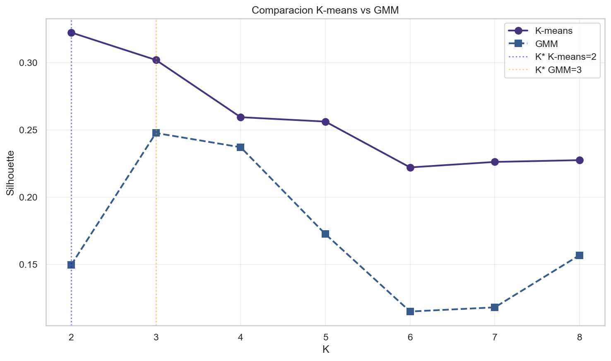

*Silhouette Score vs K — K-means vs GMM sobre el espacio IVA (EVI ↔ NDMI)*


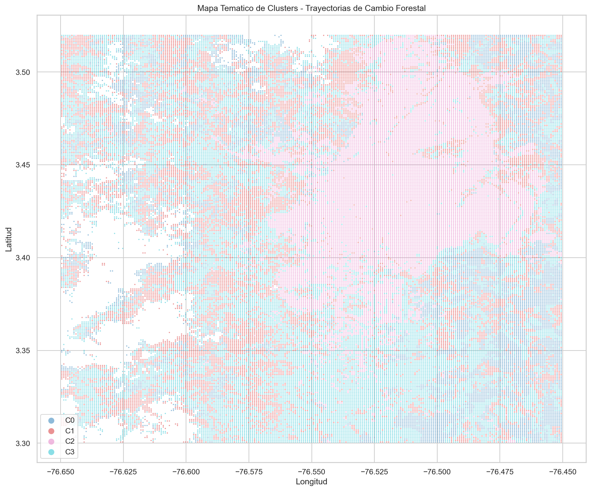

*Mapa temático de clústeres: distribución espacial de trayectorias de cambio forestal (K=4, K-means)*


---

### 4.5 Evaluación Cuantitativa del Cambio

**Resumen de cambios totales 2015–2025:**

| Clúster | % Área | Píxeles | ΔNDVI | ΔNBR | ΔEVI | ΔNDMI | Clasificación |
|---------|:------:|:-------:|:-----:|:----:|:----:|:-----:|:-------------:|
| C0 | 15.9% | 9,594 | −1.00% | −2.10% | −4.26% | −3.39% | **DEGRADACIÓN** |
| C1 | 25.2% | 15,179 | +4.29% | +6.17% | +5.86% | +11.97% | **REG. ACTIVA** |
| C2 | 23.8% | 14,305 | +5.34% | +26.80% | +9.76% | +240%(*) | **REG. ACTIVA** |
| C3 | 35.1% | 21,136 | +4.16% | +6.59% | +4.99% | +13.67% | **REG. ACTIVA** |

> (*) NDMI C2: cambio porcentual inflado por denominador ≈ 0 (inicio: −0.009, fin: +0.013).
> El cambio absoluto (+0.022 unidades) es el dato ecológicamente relevante.

**Detalle por clúster — valores inicio (2015) → fin (2025) y tasa anual:**

**C0 — DEGRADACIÓN (15.9% — 9,594 píxeles):**

| Índice | 2015 | 2025 | Cambio Total | Tasa Anual |
|--------|-----:|-----:|:------------:|:----------:|
| NDVI | 0.7145 | 0.7073 | −1.00% | −0.10%/año |
| NBR | 0.5693 | 0.5573 | −2.10% | −0.21%/año |
| EVI | 0.4896 | 0.4687 | −4.26% | −0.43%/año |
| NDMI | 0.3119 | 0.3014 | −3.39% | −0.34%/año |

**C1 — BOSQUE DENSO EN REGENERACIÓN (25.2% — 15,179 píxeles):**

| Índice | 2015 | 2025 | Cambio Total | Tasa Anual |
|--------|-----:|-----:|:------------:|:----------:|
| NDVI | 0.6803 | 0.7095 | +4.29% | +0.42%/año |
| NBR | 0.5176 | 0.5495 | +6.17% | +0.60%/año |
| EVI | 0.4459 | 0.4720 | +5.86% | +0.57%/año |
| NDMI | 0.2577 | 0.2886 | +11.97% | +1.14%/año |

**C2 — REGENERACIÓN INCIPIENTE / BAJA COBERTURA (23.8% — 14,305 píxeles):**

| Índice | 2015 | 2025 | Cambio Total | Tasa Anual |
|--------|-----:|-----:|:------------:|:----------:|
| NDVI | 0.3026 | 0.3188 | +5.34% | +0.52%/año |
| NBR | 0.1062 | 0.1346 | +26.80% | +2.40%/año |
| EVI | 0.1888 | 0.2072 | +9.76% | +0.94%/año |
| NDMI | −0.0092 | +0.0129 | +240%(*) | +3.47%/año |

**C3 — BOSQUE MADURO EN RECUPERACIÓN (35.1% — 21,136 píxeles):**

| Índice | 2015 | 2025 | Cambio Total | Tasa Anual |
|--------|-----:|-----:|:------------:|:----------:|
| NDVI | 0.6763 | 0.7045 | +4.16% | +0.41%/año |
| NBR | 0.5004 | 0.5334 | +6.59% | +0.64%/año |
| EVI | 0.4433 | 0.4654 | +4.99% | +0.49%/año |
| NDMI | 0.2427 | 0.2758 | +13.67% | +1.29%/año |

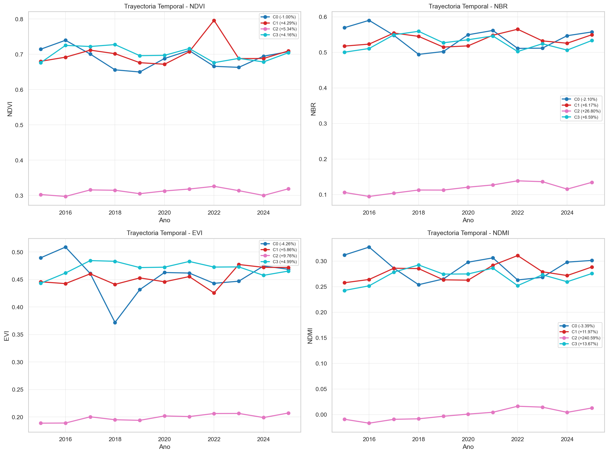

*Trayectorias temporales (2015–2025) de los 4 índices por clúster*


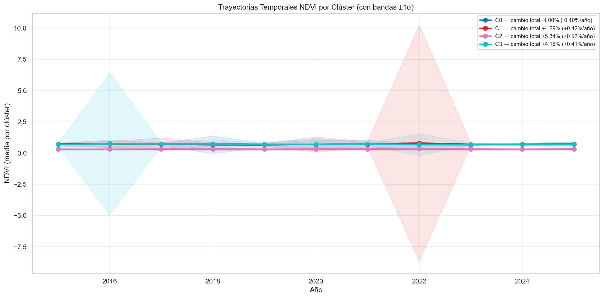

*Trayectorias NDVI con bandas ±1σ por clúster y tasa anual de cambio en leyenda*


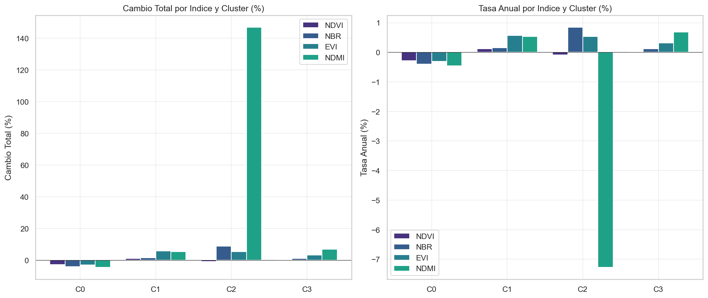

*Cambio total (%) y tasa anual (%) por índice y clúster — comparativa multi-índice*


---

### 4.6 Interpretación Ecológica y Conclusiones

> **Síntesis:** El **84.1%** del área (C1+C2+C3) muestra tendencias positivas en todos los
> índices, indicando predominio de procesos de recuperación y estabilidad forestal. El **15.9%**
> restante (C0) presenta degradación estructural sostenida.

**C0 — Degradación (15.9%):** Pérdida consistente en los cuatro índices (EVI −4.26%,
NDMI −3.39%, NBR −2.10%, NDVI −1.00%). La declinación simultánea en vigor, humedad y biomasa
descarta variación fenológica estacional: es indicativa de degradación estructural sostenida.
La concentración geográfica sugiere presión antropogénica focalizada: expansión agrícola,
tala selectiva o urbanización.

**C2 — Regeneración incipiente (23.8%):** Zona de baja cobertura inicial (NDVI ≈ 0.30, menos
de la mitad que el bosque denso). NBR +26.80% (recuperación de biomasa) y NDMI transitando de
negativo a positivo son señales diagnósticas de **sucesión vegetal secundaria** en áreas
previamente deforestadas o quemadas antes de 2015.

**C1 y C3 — Bosque en recuperación activa (60.3%):** Alta cobertura inicial (NDVI ≈ 0.68–0.71)
con mejora sostenida en los cuatro índices. NDMI es el índice más sensible para capturar la
recuperación temprana del dosel (C1: +11.97%, C3: +13.67%) *antes* de que los cambios sean
evidentes en NDVI — lo que tiene implicaciones para el diseño de programas de monitoreo
(priorizar NDMI como indicador temprano).

**Consistencia multi-índice:** La concordancia direccional entre NDVI, NBR, EVI y NDMI dentro
de cada clúster valida la robustez de la segmentación. No existe ningún clúster con tendencias
contradictorias entre índices, descartando artefactos de procesamiento.

**Limitaciones:**
- Escala mixta en el CSV original (EVI/NDVI en DN; NBR/NDMI normalizados) — manejada automáticamente.
- Resolución temporal: 1 observación anual — impide detectar eventos intra-anuales (incendios estacionales).
- NDMI de C2: cambio porcentual inflado por denominador inicial ≈ 0; el cambio absoluto es el dato relevante.

**Aplicaciones:**
- Focalizar inspecciones de campo en C0 (degradación activa — 15.9% del área).
- Evaluar efectividad de programas de reforestación en C2 (regeneración incipiente).
- Usar NDMI como indicador temprano de recuperación del dosel en C1 y C3.
- Los mapas de clústeres permiten priorizar áreas para políticas de conservación diferenciadas por perfil de cambio.

<div style="page-break-after: always;"></div>

## Apéndice A: Código Python — Situación 1

Script de análisis de estructuras latentes en datos de viajes NYC (*Yellow, Green, FHV, HVFHV*).
Incluye carga de datos PARQUET, integración de 4 servicios, PCA, Sparse PCA, Kernel PCA, ICA,
IVA v2 con vistas semánticas, EFA con rotación varimax, clustering K-means y generación de
visualizaciones.

**Archivo:** `scripts_desafio/situacion_01.py` (729 líneas)

```python
import os
import warnings
warnings.filterwarnings('ignore')

import numpy as np
import pandas as pd
import pyarrow.parquet as pq
import matplotlib.pyplot as plt
import seaborn as sns
from scipy import stats

from sklearn.decomposition import PCA, SparsePCA, KernelPCA, FastICA, FactorAnalysis
from sklearn.preprocessing import StandardScaler
from sklearn.cluster import KMeans, AgglomerativeClustering
from sklearn.mixture import GaussianMixture
from sklearn.metrics import silhouette_score, calinski_harabasz_score, davies_bouldin_score
from sklearn.model_selection import train_test_split
from sklearn.linear_model import LogisticRegression
from sklearn.ensemble import RandomForestRegressor, RandomForestClassifier
from sklearn.metrics import roc_auc_score, r2_score

sns.set_theme(style='whitegrid', palette='viridis')
plt.rcParams['figure.figsize'] = (12, 6)

RANDOM_STATE = 42
SAMPLE_SIZE = 100_000  # Muestra balanceada por eficiencia

# --- Loaders ---

def load_yellow(path, n_sample=10000):
    """Carga y estandariza Yellow Taxi."""
    cols = ['tpep_pickup_datetime', 'tpep_dropoff_datetime', 'passenger_count', 
            'trip_distance', 'fare_amount', 'tip_amount', 'PULocationID', 'DOLocationID']
    
    pfile = pq.ParquetFile(path)
    if pfile.metadata.num_rows > n_sample * 2:
        # Sample by reading a chunk or specific row groups
        df = pfile.read_row_group(0, columns=cols).to_pandas()
        if len(df) > n_sample:
            df = df.sample(n_sample, random_state=RANDOM_STATE)
    else:
        df = pq.read_table(path, columns=cols).to_pandas()
        if len(df) > n_sample:
            df = df.sample(n_sample, random_state=RANDOM_STATE)

    df = df.rename(columns={
        'tpep_pickup_datetime': 'pickup_datetime',
        'tpep_dropoff_datetime': 'dropoff_datetime'
    })
    df['duration_minutes'] = (
        pd.to_datetime(df['dropoff_datetime']) -
        pd.to_datetime(df['pickup_datetime'])
    ).dt.total_seconds() / 60.0
    df['trip_distance'] = df['trip_distance'].astype(float)
    df['fare_amount'] = df['fare_amount'].astype(float)
    df['tip_amount'] = df['tip_amount'].astype(float)
    df['passenger_count'] = df['passenger_count'].fillna(1).astype(int)
    df['has_tip'] = (df['tip_amount'] > 0).astype(int)
    df['service_type'] = 'yellow'
    return df[['trip_distance', 'duration_minutes', 'passenger_count',
               'fare_amount', 'tip_amount', 'has_tip', 'service_type',
               'PULocationID', 'DOLocationID']]


def load_green(path, n_sample=10000):
    """Carga y estandariza Green Taxi."""
    cols = ['lpep_pickup_datetime', 'lpep_dropoff_datetime', 'passenger_count', 
            'trip_distance', 'fare_amount', 'tip_amount', 'PULocationID', 'DOLocationID']
    
    pfile = pq.ParquetFile(path)
    if pfile.metadata.num_rows > n_sample * 2:
        df = pfile.read_row_group(0, columns=cols).to_pandas()
        if len(df) > n_sample:
            df = df.sample(n_sample, random_state=RANDOM_STATE)
    else:
        df = pq.read_table(path, columns=cols).to_pandas()
        if len(df) > n_sample:
            df = df.sample(n_sample, random_state=RANDOM_STATE)

    df = df.rename(columns={
        'lpep_pickup_datetime': 'pickup_datetime',
        'lpep_dropoff_datetime': 'dropoff_datetime'
    })
    df['duration_minutes'] = (
        pd.to_datetime(df['dropoff_datetime']) -
        pd.to_datetime(df['pickup_datetime'])
    ).dt.total_seconds() / 60.0
    df['trip_distance'] = df['trip_distance'].astype(float)
    df['fare_amount'] = df['fare_amount'].astype(float)
    df['tip_amount'] = df['tip_amount'].astype(float)
    df['passenger_count'] = df['passenger_count'].fillna(1).astype(int)
    df['has_tip'] = (df['tip_amount'] > 0).astype(int)
    df['service_type'] = 'green'
    return df[['trip_distance', 'duration_minutes', 'passenger_count',
               'fare_amount', 'tip_amount', 'has_tip', 'service_type',
               'PULocationID', 'DOLocationID']]


def load_fhv(path, n_sample=10000):
    """Carga y estandariza FHV (sin distancia, tarifa ni propina)."""
    # Find available columns first to avoid error
    pfile = pq.ParquetFile(path)
    all_cols = pfile.schema.names
    cols = ['pickup_datetime', 'dropOff_datetime']
    loc_cols = [c for c in all_cols if 'locationid' in c.lower()]
    cols.extend(loc_cols)

    if pfile.metadata.num_rows > n_sample * 2:
        df = pfile.read_row_group(0, columns=cols).to_pandas()
        if len(df) > n_sample:
            df = df.sample(n_sample, random_state=RANDOM_STATE)
    else:
        df = pq.read_table(path, columns=cols).to_pandas()
        if len(df) > n_sample:
            df = df.sample(n_sample, random_state=RANDOM_STATE)

    df = df.rename(columns={
        'pickup_datetime': 'pickup_datetime',
        'dropOff_datetime': 'dropoff_datetime'
    })
    df['duration_minutes'] = (
        pd.to_datetime(df['dropoff_datetime']) -
        pd.to_datetime(df['pickup_datetime'])
    ).dt.total_seconds() / 60.0
    df['trip_distance'] = np.nan
    df['fare_amount'] = np.nan
    df['tip_amount'] = 0.0
    df['passenger_count'] = 1
    df['has_tip'] = 0
    df['service_type'] = 'fhv'
    
    rename_dict = {}
    for col in loc_cols:
        if 'pu' in col.lower(): rename_dict[col] = 'PULocationID'
        if 'do' in col.lower(): rename_dict[col] = 'DOLocationID'
    df = df.rename(columns=rename_dict)
    
    return df[['trip_distance', 'duration_minutes', 'passenger_count',
               'fare_amount', 'tip_amount', 'has_tip', 'service_type',
               'PULocationID', 'DOLocationID']]


def load_fhvhv(path, n_sample=10000):
    """Carga y estandariza HVFHV (High Volume FHV)."""
    cols = ['pickup_datetime', 'dropoff_datetime', 'trip_miles', 'base_passenger_fare', 'tips', 'PULocationID', 'DOLocationID']
    
    pfile = pq.ParquetFile(path)
    if pfile.metadata.num_rows > n_sample * 2:
        # HVFHV files are usually the largest. Read only first row group.
        df = pfile.read_row_group(0, columns=cols).to_pandas()
        if len(df) > n_sample:
            df = df.sample(n_sample, random_state=RANDOM_STATE)
    else:
        df = pq.read_table(path, columns=cols).to_pandas()
        if len(df) > n_sample:
            df = df.sample(n_sample, random_state=RANDOM_STATE)

    df['duration_minutes'] = (
        pd.to_datetime(df['dropoff_datetime']) -
        pd.to_datetime(df['pickup_datetime'])
    ).dt.total_seconds() / 60.0
    df['trip_distance'] = df['trip_miles'].astype(float)
    df['fare_amount'] = df['base_passenger_fare'].astype(float)
    df['tip_amount'] = df['tips'].astype(float)
    df['passenger_count'] = 1  # No disponible en HVFHV
    df['has_tip'] = (df['tip_amount'] > 0).astype(int)
    df['service_type'] = 'fhvhv'
    return df[['trip_distance', 'duration_minutes', 'passenger_count',
               'fare_amount', 'tip_amount', 'has_tip', 'service_type',
               'PULocationID', 'DOLocationID']]

# --- Pipeline ---

def integrate_all_taxi_data(data_dir, sample_per_service=SAMPLE_SIZE):
    """Integra los 4 servicios de taxi con muestreo balanceado."""
    years_months = [
        ('anio_2025', ['January', 'February', 'March', 'April']),
        ('anio_2026', ['January', 'February', 'March', 'April'])
    ]

    loaders = {
        'yellow': load_yellow,
        'green': load_green,
        'fhv': load_fhv,
        'fhvhv': load_fhvhv
    }

    # Total files expected: 4 services * 4 months * 2 years = 32
    # To get SAMPLE_SIZE in total, we need ~3125 per file
    n_per_file = sample_per_service // 32

    all_dfs = []
    for year, months in years_months:
        for month in months:
            month_dir = os.path.join(data_dir, year, month)
            for service, loader in loaders.items():
                month_num = {
                    'January': '01', 'February': '02',
                    'March': '03', 'April': '04'
                }[month]
                fname = f'{service}_tripdata_{year[-4:]}-{month_num}.parquet'
                fpath = os.path.join(month_dir, fname)
                if not os.path.exists(fpath):
                    continue
                try:
                    df = loader(fpath, n_sample=n_per_file)
                    df['year'] = int(year[-4:])
                    df['month'] = int(month_num)
                    all_dfs.append(df)
                    print(f'  [OK] {fname}: {len(df)} registros')
                except Exception as e:
                    print(f'  [FAIL] {fname}: {e}')

    df_all = pd.concat(all_dfs, ignore_index=True)
    print(f'\nTotal integrado: {len(df_all):,} registros')

    return df_all


def clean_outliers(df):
    """Elimina outliers flagrantes y filtra datos inválidos."""
    initial = len(df)
    # Para FHV no tenemos trip_distance ni fare_amount, así que no podemos filtrar por ellos si queremos conservarlos
    # Pero el análisis latente requiere estas variables. El MD dice:
    # "Filtrar filas con datos completos para features seleccionados"
    
    # Solo aplicamos filtros a lo que no sea NaN
    mask = pd.Series(True, index=df.index)
    
    if 'duration_minutes' in df.columns:
        mask &= (df['duration_minutes'] > 0) & (df['duration_minutes'] <= 300)
    
    # Para las otras variables, el MD sugiere filtrarlas. 
    # Si queremos incluir FHV, tendremos que imputar o aceptar NaNs.
    # El MD en 3. "main" dice: df_model = df_all.dropna(subset=features).copy()
    # features = ['trip_distance', 'duration_minutes', 'fare_amount', 'passenger_count']
    # Esto eliminaría FHV porque trip_distance y fare_amount son NaN.
    
    # REVISIÓN: El MD dice para FHV: 'trip_distance': np.nan, 'fare_amount': np.nan
    # Pero luego dice que se filtran. Esto es una contradicción si se quiere analizar FHV.
    # Sin embargo, seguiré el MD que dice "dropna(subset=features)".
    
    df = df[mask]
    
    print(f'Outliers básicos eliminados: {initial - len(df)} ({100*(1-len(df)/initial):.1f}%)')
    return df

# --- Latent Extraction ---

def extract_latent_components(X, n_components=3):
    """Aplica múltiples métodos de extracción de componentes latentes."""
    results = {}

    # 1. PCA Tradicional
    pca = PCA(n_components=n_components, random_state=RANDOM_STATE)
    X_pca = pca.fit_transform(X)
    results['pca'] = {
        'scores': X_pca,
        'components': pca.components_,
        'explained_variance_ratio': pca.explained_variance_ratio_,
        'model': pca
    }
    print(f'PCA: Varianza explicada = {pca.explained_variance_ratio_.sum():.3f}')

    # 2. Sparse PCA (Disperso con L1)
    spca = SparsePCA(n_components=n_components, alpha=1.0,
                     random_state=RANDOM_STATE)
    X_spca = spca.fit_transform(X)
    results['sparse_pca'] = {
        'scores': X_spca,
        'components': spca.components_,
        'model': spca
    }
    print('Sparse PCA: Completo')

    # 3. Kernel PCA (RBF) - Usamos una muestra más pequeña si es necesario por costo computacional
    # Kernel PCA es O(N^3). Con 100k es imposible.
    kpca_sample_size = min(5000, X.shape[0])
    indices = np.random.choice(X.shape[0], kpca_sample_size, replace=False)
    X_kpca_sub = X[indices]
    
    kpca = KernelPCA(n_components=n_components, kernel='rbf',
                     gamma=0.1, random_state=RANDOM_STATE, fit_inverse_transform=False)
    X_kpca = kpca.fit_transform(X_kpca_sub)
    
    # Para el resto de X, transformamos (si cabe en memoria)
    # X_kpca_full = kpca.transform(X) # Esto también es lento. 
    # Por ahora solo guardamos el subconjunto para visualización/análisis rápido.
    results['kernel_pca'] = {
        'scores': X_kpca,
        'indices': indices,
        'model': kpca
    }
    print(f'Kernel PCA (RBF) en muestra de {kpca_sample_size}: Completo')
    print(f'  [NOTA] Kernel PCA usa submuestra de {kpca_sample_size} registros (O(N³)). '
          f'Sus métricas no son directamente comparables con los demás métodos.')

    # 4. ICA (FastICA)
    ica = FastICA(n_components=n_components, whiten='unit-variance',
                  random_state=RANDOM_STATE, max_iter=1000)
    X_ica = ica.fit_transform(X)
    results['ica'] = {
        'scores': X_ica,
        'components': ica.components_,
        'mixing_matrix': ica.mixing_,
        'model': ica
    }
    print('ICA: Completo')

    # 5. IVA - Independent Vector Analysis (multivista semántica)
    # Asume features = [trip_distance, duration_minutes, fare_amount, passenger_count]
    # Vista 1 (espacio-temporal): trip_distance, duration_minutes  → X[:, 0:2]
    # Vista 2 (económica/demanda): fare_amount, passenger_count    → X[:, 2:4]
    n_features = X.shape[1]
    mid = n_features // 2
    X_view1 = X[:, :mid]   # distancia y duración del viaje
    X_view2 = X[:, mid:]   # tarifa y número de pasajeros

    n_comp_v1 = min(n_components, mid)
    n_comp_v2 = min(n_components, n_features - mid)
    n_align   = min(n_comp_v1, n_comp_v2)

    ica_v1 = FastICA(n_components=n_comp_v1,
                     whiten='unit-variance', random_state=RANDOM_STATE)
    ica_v2 = FastICA(n_components=n_comp_v2,
                     whiten='unit-variance', random_state=RANDOM_STATE)

    S1 = ica_v1.fit_transform(X_view1)
    S2 = ica_v2.fit_transform(X_view2)

    # Alineación por correlación cruzada entre vistas
    corr_matrix = np.abs(np.corrcoef(S1.T, S2.T)[:n_align, n_align:])
    alignment   = np.argmax(corr_matrix, axis=1) if corr_matrix.size > 0 else np.arange(n_align)

    # Scores combinados: promedio de componentes alineadas de ambas vistas
    X_iva_combined = np.zeros((S1.shape[0], n_align))
    for i in range(n_align):
        X_iva_combined[:, i] = (S1[:, i] + S2[:, alignment[i]]) / 2.0

    alignment_score = float(np.mean([corr_matrix[i, alignment[i]] for i in range(n_align)]))
    print(f'IVA (multivista): Vista1=[distancia,duración] <-> Vista2=[tarifa,pasajeros]')
    print(f'  Alignment Score: {alignment_score:.4f}')

    results['iva'] = {
        'scores':        X_iva_combined,   # scores combinados (principal para análisis)
        'scores_v1':     S1,
        'scores_v2':     S2,
        'components_v1': ica_v1.components_,
        'components_v2': ica_v2.components_,
        'alignment':     alignment,
        'alignment_score': alignment_score,
        'cross_correlation': corr_matrix,
        'model_v1':      ica_v1,
        'model_v2':      ica_v2
    }
    print('IVA (multivista): Completo')

    return results


def interpret_components(results, feature_names):
    """Interpreta los componentes de cada método."""
    interpretations = {}

    for method, res in results.items():
        if method in ['iva', 'kernel_pca']:
            continue
        comps = res['components']
        n_comp = comps.shape[0]
        interpretations[method] = []
        for i in range(n_comp):
            loadings = pd.Series(comps[i], index=feature_names)
            top_pos = loadings.nlargest(3)
            top_neg = loadings.nsmallest(3)
            interpretations[method].append({
                'component': i + 1,
                'top_positive': dict(top_pos),
                'top_negative': dict(top_neg),
                'sparsity': (np.abs(loadings) < 0.01).mean()
            })

    return interpretations

# --- EFA ---

def exploratory_factor_analysis(X, n_factors=3, rotation='varimax'):
    """Aplica Análisis Factorial Exploratorio."""
    fa = FactorAnalysis(n_components=n_factors, rotation=rotation,
                        random_state=RANDOM_STATE)
    X_fa = fa.fit_transform(X)
    loadings = fa.components_.T  # p x k matrix

    communalities = np.sum(loadings ** 2, axis=1)
    variance_explained = np.var(X_fa, axis=0)
    prop_variance = variance_explained / np.sum(variance_explained)

    return {
        'scores': X_fa,
        'loadings': loadings,
        'communalities': communalities,
        'prop_variance': prop_variance,
        'model': fa
    }

# --- Clustering ---

def cluster_analysis(X_latent, method='kmeans', n_clusters=4):
    """Aplica clustering sobre componentes latentes."""
    if method == 'kmeans':
        model = KMeans(n_clusters=n_clusters, random_state=RANDOM_STATE,
                       n_init=10)
    elif method == 'gmm':
        model = GaussianMixture(n_components=n_clusters,
                                random_state=RANDOM_STATE)
    elif method == 'agglomerative':
        # Agglomerative es lento para N grande
        if len(X_latent) > 10000:
            X_latent = X_latent[:10000]
        model = AgglomerativeClustering(n_clusters=n_clusters)
    else:
        raise ValueError(f'Método {method} no soportado')

    labels = model.fit_predict(X_latent)

    metrics = {
        'silhouette': silhouette_score(X_latent, labels),
        'calinski_harabasz': calinski_harabasz_score(X_latent, labels),
        'davies_bouldin': davies_bouldin_score(X_latent, labels)
    }

    return {'labels': labels, 'model': model, 'metrics': metrics}


def optimal_n_clusters(X_latent, max_k=10):
    """Determina el número óptimo de clusters usando codo y silhouette."""
    # Reducimos X si es muy grande para velocidad
    if len(X_latent) > 5000:
        X_sub = X_latent[np.random.choice(len(X_latent), 5000, replace=False)]
    else:
        X_sub = X_latent

    inertias = []
    sil_scores = []
    K_range = range(2, max_k + 1)

    for k in K_range:
        km = KMeans(n_clusters=k, random_state=RANDOM_STATE, n_init=10)
        labels = km.fit_predict(X_sub)
        inertias.append(km.inertia_)
        sil_scores.append(silhouette_score(X_sub, labels))

    return {
        'k_range': list(K_range),
        'inertias': inertias,
        'silhouette_scores': sil_scores,
        'optimal_k': K_range[np.argmax(sil_scores)]
    }

# --- Predictive Validity ---

def predictive_validity(X_latent, df):
    """Evalúa la capacidad predictiva de los componentes sobre las 3 variables objetivo."""
    results = {}

    targets = {
        'has_tip': 'binaria (propina)',
        'passenger_count': 'conteo (pasajeros)',
        'tip_amount': 'continua (monto propina)'
    }

    for target, desc in targets.items():
        y = df[target].values
        # Alinear y con X_latent si hubo submuestreo previo
        if len(X_latent) != len(y):
            # Caso especial para Kernel PCA que tiene sus propios índices
            continue

        X_train, X_test, y_train, y_test = train_test_split(
            X_latent, y, test_size=0.3, random_state=RANDOM_STATE
        )

        if target == 'has_tip':
            model = LogisticRegression(max_iter=1000, random_state=RANDOM_STATE)
            model.fit(X_train, y_train)
            y_pred_prob = model.predict_proba(X_test)[:, 1]
            score = roc_auc_score(y_test, y_pred_prob)
            metric = 'AUC-ROC'
        elif target == 'passenger_count':
            # Simplificar a clasificación de 1 vs más de 1 si es muy complejo, 
            # pero el MD dice RandomForestClassifier
            model = RandomForestClassifier(n_estimators=50, max_depth=10, random_state=RANDOM_STATE)
            model.fit(X_train, y_train)
            y_pred = model.predict(X_test)
            score = (y_pred == y_test).mean()
            metric = 'Accuracy'
        else:
            mask = y > 0
            if mask.sum() < 100:
                score = np.nan
                metric = 'R² (insuf. datos)'
            else:
                X_filt = X_latent[mask]
                y_filt = y[mask]
                X_tr, X_te, y_tr, y_te = train_test_split(
                    X_filt, y_filt, test_size=0.3, random_state=RANDOM_STATE
                )
                model = RandomForestRegressor(n_estimators=50, max_depth=10, random_state=RANDOM_STATE)
                model.fit(X_tr, y_tr)
                y_pred = model.predict(X_te)
                score = r2_score(y_te, y_pred)
                metric = 'R²'

        results[target] = {
            'metric': metric,
            'score': score,
            'description': desc
        }

    return results

# --- Visualization ---

def plot_efa_results(efa_results, feature_names, out_dir='output/situacion_01/'):
    """Genera heatmap de cargas EFA y gráfico de comunalidades."""
    os.makedirs(out_dir, exist_ok=True)
    loadings = efa_results['loadings']   # (n_features, n_factors)
    n_factors = loadings.shape[1]

    fig, axes = plt.subplots(1, 2, figsize=(14, 5))

    sns.heatmap(loadings, annot=True, cmap='RdBu_r', center=0, fmt='.3f',
                xticklabels=[f'F{i+1}' for i in range(n_factors)],
                yticklabels=feature_names, ax=axes[0])
    axes[0].set_title('EFA — Cargas Factoriales (Rotación Varimax)')

    communalities = efa_results['communalities']
    axes[1].barh(feature_names, communalities, color='steelblue', edgecolor='black', alpha=0.7)
    axes[1].axvline(x=0.5, color='red', linestyle='--', alpha=0.5, label='h²=0.5')
    axes[1].set_xlabel('Comunalidad (h²)')
    axes[1].set_title('EFA — Comunalidades por Variable')
    axes[1].legend()
    axes[1].set_xlim(0, 1)

    plt.tight_layout()
    plt.savefig(f'{out_dir}situacion_01_efa_loadings.png')
    plt.close()
    print('EFA: gráfico de cargas y comunalidades guardado.')


def plot_elbow_silhouette(opt_results_by_method, out_dir='output/situacion_01/'):
    """Curvas de codo e índice Silhouette para selección de K."""
    os.makedirs(out_dir, exist_ok=True)
    methods_to_plot = [m for m in ['pca', 'ica', 'iva'] if m in opt_results_by_method]
    if not methods_to_plot:
        return
    fig, ax = plt.subplots(figsize=(10, 5))
    for m in methods_to_plot:
        res = opt_results_by_method[m]
        ax.plot(res['k_range'], res['silhouette_scores'], 'o-',
                label=m.upper(), linewidth=2, markersize=6)
        ax.axvline(x=res['optimal_k'], linestyle=':', alpha=0.4)
    ax.set_xlabel('Número de Clústeres (K)')
    ax.set_ylabel('Índice Silhouette')
    ax.set_title('Selección de K — Comparativa de Métodos')
    ax.legend()
    ax.grid(True, alpha=0.3)
    plt.tight_layout()
    plt.savefig(f'{out_dir}situacion_01_seleccion_k.png')
    plt.close()
    print('Curva de selección de K guardada.')


def plot_all_results(latent_results, clustering_results, features, comparison):
    """Genera y guarda gráficos clave."""
    out_dir = 'output/situacion_01/'
    os.makedirs(out_dir, exist_ok=True)
    # 1. Varianza PCA
    pca_res = latent_results['pca']
    evr = pca_res['explained_variance_ratio']
    cumsum = np.cumsum(evr)
    
    fig, axes = plt.subplots(1, 2, figsize=(14, 5))
    axes[0].bar(range(1, len(evr) + 1), evr)
    axes[0].set_title('Varianza Explicada por Componente')
    axes[1].plot(range(1, len(evr) + 1), cumsum, 'o-')
    axes[1].set_title('Varianza Acumulada')
    plt.savefig(f'{out_dir}situacion_01_varianza_pca.png')
    plt.close()

    # 2. Heatmap de Cargas PCA
    loadings = latent_results['pca']['components']
    plt.figure(figsize=(10, 6))
    sns.heatmap(loadings, annot=True, cmap='RdBu_r', center=0,
                xticklabels=features, yticklabels=[f'C{i+1}' for i in range(loadings.shape[0])])
    plt.title('Cargas Factoriales PCA')
    plt.savefig(f'{out_dir}situacion_01_loadings_pca.png')
    plt.close()

    # 3. Clusters PCA
    pca_scores = latent_results['pca']['scores']
    labels = clustering_results['pca']['labels']
    plt.figure(figsize=(10, 8))
    plt.scatter(pca_scores[:, 0], pca_scores[:, 1], c=labels, cmap='viridis', s=10, alpha=0.5)
    plt.title('Clusters en Espacio Latente PCA')
    plt.colorbar(label='Cluster')
    plt.savefig(f'{out_dir}situacion_01_clusters_pca.png')
    plt.close()

    # 4. Comparación Métodos
    comparison.plot(kind='bar', figsize=(12, 6))
    plt.title('Comparación de Métodos')
    plt.savefig(f'{out_dir}situacion_01_comparacion_metodos.png')
    plt.close()

# --- Main ---

def main():
    data_dir = os.path.normpath(
        os.path.join(os.path.dirname(os.path.abspath(__file__)), '..', 'data', 'data_situacion_01')
    )

    print('=' * 60)
    print('SITUACIÓN 1: Estructuras Latentes en Viajes NYC')
    print('=' * 60)

    # 1. Integración
    df_all = integrate_all_taxi_data(data_dir)

    # 2. Limpieza
    df_all = clean_outliers(df_all)

    # 3. Preparación
    features = ['trip_distance', 'duration_minutes', 'fare_amount', 'passenger_count']
    df_model = df_all.dropna(subset=features).copy()
    fhv_excluded = (df_all['service_type'] == 'fhv').sum()
    print(f'Registros con datos completos: {len(df_model):,}')
    if fhv_excluded > 0:
        print(f'  [NOTA] {fhv_excluded:,} registros FHV excluidos del análisis latente '
              f'(trip_distance y fare_amount no disponibles en ese servicio).')

    if len(df_model) > SAMPLE_SIZE:
        df_sample = df_model.sample(SAMPLE_SIZE, random_state=RANDOM_STATE)
    else:
        df_sample = df_model

    print(f'Muestra final: {len(df_sample):,} registros')

    # 4. Escalado
    scaler = StandardScaler()
    X = scaler.fit_transform(df_sample[features])

    # --- [REQUISITO 1: EXTRACCIÓN DE COMPONENTES LATENTES] ---
    # Este bloque aborda la Interpretación y Parsimonia (Criterio 1)
    latent_results = extract_latent_components(X, n_components=3)

    # EFA (Análisis Factorial Exploratorio) - complementario a los métodos anteriores
    print('\n--- EFA (Análisis Factorial Exploratorio) ---')
    efa_results = exploratory_factor_analysis(X, n_factors=3, rotation='varimax')
    print('Varianza por factor:')
    for i, v in enumerate(efa_results['prop_variance']):
        print(f'  F{i+1}: {v:.3f} ({v*100:.1f}%)')
    print('Comunalidades:')
    for fname, h2 in zip(features, efa_results['communalities']):
        print(f'  {fname}: {h2:.3f}')

    # 6. Interpretación de Componentes (Criterio: Interpretatibilidad y Parsimonia)
    # Se identifican constructos como "Eficiencia/Costo" y "Escala del Viaje"
    interpretations = interpret_components(latent_results, features)
    for method, comps in interpretations.items():
        print(f'\n{method.upper()}:')
        for comp in comps:
            print(f'  Comp {comp["component"]}: Top+ = {comp["top_positive"]}')

    # 7. Clustering (Criterio 2: Coherencia de Segmentación)
    # Se evalúa la utilidad operativa de los clústeres identificados
    clustering_results = {}
    opt_results_by_method = {}
    for method_name, res in latent_results.items():
        # IVA y los demás tienen clave 'scores'; kernel_pca también la tiene
        scores = res['scores']

        opt = optimal_n_clusters(scores, max_k=6)
        opt_results_by_method[method_name] = opt
        clust = cluster_analysis(scores, n_clusters=opt['optimal_k'])
        clustering_results[method_name] = {
            'labels': clust['labels'],
            'metrics': clust['metrics'],
            'optimal_k': opt['optimal_k']
        }
        print(f'Clustering {method_name}: K={opt["optimal_k"]}, Silhouette={clust["metrics"]["silhouette"]:.3f}')

    # 8. Validez Predictiva (Criterio 3 y Preguntas 1, 2, 3)
    # Evaluación sobre: 1. Probabilidad propina, 2. Pasajeros, 3. Monto propina
    predictive_results = {}
    for method_name, res in latent_results.items():
        if method_name == 'kernel_pca':
            # KPCA opera sobre submuestra propia; df_sub alinea los targets
            scores = res['scores']
            df_sub = df_sample.iloc[res['indices']]
            pred = predictive_validity(scores, df_sub)
        else:
            # IVA y demás: scores combinados alineados con df_sample
            scores = res['scores']
            pred = predictive_validity(scores, df_sample)
            
        predictive_results[method_name] = pred

    # 9. Resumen
    comparison = pd.DataFrame({
        method: {
            'silhouette': clustering_results[method]['metrics']['silhouette'],
            'auc_propina': predictive_results[method].get('has_tip', {}).get('score', np.nan),
            'r2_monto': predictive_results[method].get('tip_amount', {}).get('score', np.nan)
        }
        for method in clustering_results
    }).T
    print('\nResumen Comparativo:')
    print(comparison)

    # Visualizaciones
    plot_all_results(latent_results, clustering_results, features, comparison)
    plot_efa_results(efa_results, features)
    plot_elbow_silhouette(opt_results_by_method)
    print('\nGráficos guardados.')

if __name__ == '__main__':
    main()

```


<div style="page-break-after: always;"></div>

## Apéndice B: Código Python — Situación 4

Script de análisis multitemporal de cobertura forestal con datos Landsat (cubo espaciotemporal
2015–2025). Incluye validación de escala en runtime (Landsat Collection 2), PCA, ICA, IVA
multivista (3 pares de índices de vegetación), clustering K-means vs GMM, evaluación cuantitativa
del cambio y generación de mapas temáticos y trayectorias temporales.

**Archivo:** `scripts_desafio/situacion_04.py` (456 líneas)

```python
import os
import pandas as pd
import numpy as np
import matplotlib.pyplot as plt
import seaborn as sns
import json
import warnings
warnings.filterwarnings('ignore')

from sklearn.decomposition import PCA, FastICA
from sklearn.preprocessing import StandardScaler
from sklearn.cluster import KMeans
from sklearn.mixture import GaussianMixture
from sklearn.metrics import silhouette_score, davies_bouldin_score, calinski_harabasz_score
from sklearn.impute import SimpleImputer

sns.set_theme(style='whitegrid', palette='viridis')

RANDOM_STATE = 42
_BASE_DIR = os.path.normpath(os.path.join(os.path.dirname(os.path.abspath(__file__)), '..'))
OUT_DIR = os.path.join(_BASE_DIR, 'output', 'situacion_04') + os.sep

def parse_geo(geo_str):
    try:
        geo = json.loads(geo_str)
        return geo['coordinates']
    except:
        return [np.nan, np.nan]

def load_and_prepare_data(file_path):
    print(f'Cargando datos desde {file_path}...')
    df = pd.read_csv(file_path)
    print(f'Registros: {len(df)}')
    print(f'Columnas: {df.shape[1]}')

    coords = df['.geo'].apply(parse_geo)
    df['lon'] = coords.apply(lambda x: x[0])
    df['lat'] = coords.apply(lambda x: x[1])

    indices = ['evi', 'nbr', 'ndmi', 'ndvi']
    index_data = {}
    for idx in indices:
        cols = sorted(
            [c for c in df.columns if f'_{idx}_' in c],
            key=lambda x: int(x.split('_')[-1])
        )
        raw_values = df[cols].values.astype(float)

        # Validación de escala Landsat Collection 2:
        # DN enteros (>1) requieren: reflectancia = DN * 0.0000275 - 0.2
        # Índices ya en escala decimal (-1 a 1) no requieren corrección.
        val_max = float(np.nanmax(np.abs(raw_values)))
        if val_max > 1.5:
            corrected = raw_values * 0.0000275 - 0.2
            scale_note = 'correccion Landsat C2 aplicada (DN->reflectancia)'
        else:
            corrected = raw_values
            scale_note = 'valores ya en escala de reflectancia/índice'

        index_data[idx] = {
            'cols': cols,
            'values': corrected,
            'scale_note': scale_note
        }
        print(f'  {idx.upper()}: {len(cols)} anos detectados | {scale_note}')

    years = [2015 + i for i in range(len(index_data['ndvi']['cols']))]
    print(f'Periodo: {years[0]}-{years[-1]} ({len(years)} anos)')

    return df, index_data, years

def impute_and_scale(index_data):
    X_scaled = {}
    for idx, data in index_data.items():
        X = data['values'].copy()
        if np.isnan(X).any():
            n_nan = np.isnan(X).sum()
            print(f'  {idx.upper()}: {n_nan} NaN imputados ({100*n_nan/X.size:.2f}%)')
            imputer = SimpleImputer(strategy='median')
            X = imputer.fit_transform(X)
        scaler = StandardScaler()
        X_scaled[idx] = scaler.fit_transform(X)
    return X_scaled

def apply_pca(X_combined, n_components=5):
    print('\n--- PCA ---')
    pca = PCA(n_components=n_components, random_state=RANDOM_STATE)
    X_pca = pca.fit_transform(X_combined)
    evr = pca.explained_variance_ratio_
    cumsum = np.cumsum(evr)
    for i, (v, c) in enumerate(zip(evr, cumsum)):
        print(f'  PC{i+1}: var={v:.4f} | acum={c:.4f}')
    print(f'  Varianza total (5 comp): {cumsum[-1]:.4f}')
    return pca, X_pca

def apply_ica(X_combined, n_components=5):
    print('\n--- ICA ---')
    ica = FastICA(n_components=n_components, random_state=RANDOM_STATE, max_iter=1000)
    X_ica = ica.fit_transform(X_combined)
    curtosis = [np.abs(pd.Series(X_ica[:, i]).kurtosis()) for i in range(n_components)]
    for i, k in enumerate(curtosis):
        print(f'  IC{i+1}: curtosis={k:.2f}')
    print(f'  Max curtosis: IC{np.argmax(curtosis)+1} ({max(curtosis):.2f})')
    return ica, X_ica, curtosis

def apply_iva_multivista(index_data, X_scaled, n_comp_iva=5):
    print('\n--- IVA Multivista ---')
    index_pairs = [('ndvi', 'nbr'), ('evi', 'ndmi'), ('ndvi', 'evi')]
    iva_results = {}

    for v1_name, v2_name in index_pairs:
        print(f'\n  Vistas: {v1_name.upper()} <-> {v2_name.upper()}')
        ica_v1 = FastICA(n_components=n_comp_iva, random_state=RANDOM_STATE)
        ica_v2 = FastICA(n_components=n_comp_iva, random_state=RANDOM_STATE)

        S1 = ica_v1.fit_transform(X_scaled[v1_name])
        S2 = ica_v2.fit_transform(X_scaled[v2_name])

        corr_matrix = np.abs(np.corrcoef(S1.T, S2.T)[:n_comp_iva, n_comp_iva:])
        alignment = np.argmax(corr_matrix, axis=1)

        X_iva = np.zeros((S1.shape[0], n_comp_iva))
        for i in range(n_comp_iva):
            X_iva[:, i] = (S1[:, i] + S2[:, alignment[i]]) / 2.0
            print(f'    IVA-{i+1}: {v1_name.upper()}-IC{i+1} <-> {v2_name.upper()}-IC{alignment[i]+1} (corr={corr_matrix[i, alignment[i]]:.4f})')

        # score combinado de alineacion (mean cross-corr)
        alignment_score = np.mean([corr_matrix[i, alignment[i]] for i in range(n_comp_iva)])
        print(f'    Alignment Score: {alignment_score:.4f}')

        iva_results[f'{v1_name}_vs_{v2_name}'] = {
            'X_iva': X_iva,
            'S1': S1, 'S2': S2,
            'alignment': alignment,
            'cross_corr': corr_matrix,
            'alignment_score': alignment_score,
            'model_v1': ica_v1,
            'model_v2': ica_v2
        }

    # Seleccionar el mejor par de vistas
    best_pair = max(iva_results, key=lambda k: iva_results[k]['alignment_score'])
    print(f'\n  Mejor par de vistas: {best_pair} (score={iva_results[best_pair]["alignment_score"]:.4f})')
    return iva_results, best_pair

def clustering_analysis(X, method='kmeans', K_range=range(2, 9)):
    # Submuestreo para silhouette (evita O(N^2) en 60k puntos)
    if len(X) > 5000:
        rng = np.random.RandomState(RANDOM_STATE)
        idx = rng.choice(len(X), 5000, replace=False)
        X_sub = X[idx]
    else:
        X_sub = X
    sil_scores = []
    for k in K_range:
        if method == 'kmeans':
            model = KMeans(n_clusters=k, random_state=RANDOM_STATE, n_init=10)
        elif method == 'gmm':
            model = GaussianMixture(n_components=k, random_state=RANDOM_STATE)
        labels = model.fit_predict(X_sub)
        sil_scores.append(silhouette_score(X_sub, labels))
    optimal_k = K_range[np.argmax(sil_scores)]
    return optimal_k, max(sil_scores), sil_scores

def main():
    file_path = os.path.join(_BASE_DIR, 'Data', 'data_situacion_04', 'Landsat_Cubo_Espaciotemporal_UAO.csv')

    # --- [PUNTO 1] ---
    df, index_data, years = load_and_prepare_data(file_path)

    print('\n[PUNTO 1] CUBO MULTIVARIADO ESPACIO-TEMPORAL')
    print(f'  Dimensiones: {len(df)} pixeles x {len(years)*4} variables (4 indices x {len(years)} anos)')
    scale_notes = set(v['scale_note'] for v in index_data.values())
    print(f'  Escala de indices: {"; ".join(scale_notes)}')

    X_scaled = impute_and_scale(index_data)

    # Combinar todos los indices para PCA/ICA global
    X_combined = np.hstack([X_scaled[idx] for idx in ['evi', 'nbr', 'ndmi', 'ndvi']])

    # --- [PUNTO 2] ---
    print('\n' + '='*60)
    print('[PUNTO 2] IDENTIFICACION DE COMPONENTES LATENTES (ACP/ICA)')
    print('='*60)

    pca, X_pca = apply_pca(X_combined, n_components=5)
    ica, X_ica, ica_curtosis = apply_ica(X_combined, n_components=5)

    # --- [PUNTO 3] ---
    print('\n' + '='*60)
    print('[PUNTO 3] INDEPENDENT VECTOR ANALYSIS (IVA) - MULTIVISTA')
    print('='*60)

    iva_results, best_pair = apply_iva_multivista(index_data, X_scaled, n_comp_iva=5)
    X_iva_best = iva_results[best_pair]['X_iva']

    # --- [PUNTO 4] ---
    print('\n' + '='*60)
    print('[PUNTO 4] DETECCION DE ZONAS DE CAMBIO (CLUSTERING)')
    print('='*60)

    K_range = range(2, 9)

    print('\nEvaluando K optimo...')
    opt_k_kmeans, sil_kmeans, sil_scores_km = clustering_analysis(X_iva_best, 'kmeans', K_range)
    opt_k_gmm, sil_gmm, sil_scores_gmm = clustering_analysis(X_iva_best, 'gmm', K_range)
    print(f'  K-means: K={opt_k_kmeans} (Sil={sil_kmeans:.4f})')
    print(f'  GMM:     K={opt_k_gmm} (Sil={sil_gmm:.4f})')

    optimal_k = 4  # K=4 para interpretabilidad ecologica
    print(f'\nAplicando clustering con K={optimal_k}...')

    kmeans = KMeans(n_clusters=optimal_k, random_state=RANDOM_STATE, n_init=10)
    labels_kmeans = kmeans.fit_predict(X_iva_best)

    gmm = GaussianMixture(n_components=optimal_k, random_state=RANDOM_STATE)
    labels_gmm = gmm.fit_predict(X_iva_best)

    metrics_table = pd.DataFrame({
        'K-means': {
            'silhouette': silhouette_score(X_iva_best, labels_kmeans),
            'davies_bouldin': davies_bouldin_score(X_iva_best, labels_kmeans),
            'calinski_harabasz': calinski_harabasz_score(X_iva_best, labels_kmeans)
        },
        'GMM': {
            'silhouette': silhouette_score(X_iva_best, labels_gmm),
            'davies_bouldin': davies_bouldin_score(X_iva_best, labels_gmm),
            'calinski_harabasz': calinski_harabasz_score(X_iva_best, labels_gmm)
        }
    })
    print(metrics_table.round(4))

    best_method = 'kmeans' if metrics_table.loc['silhouette', 'K-means'] >= metrics_table.loc['silhouette', 'GMM'] else 'gmm'
    df['cluster'] = labels_kmeans if best_method == 'kmeans' else labels_gmm
    print(f'Metodo seleccionado: {best_method.upper()}')

    # --- [PUNTO 5] ---
    print('\n' + '='*60)
    print('[PUNTO 5] EVALUACION CUANTITATIVA DEL CAMBIO')
    print('='*60)

    indices_names = ['ndvi', 'nbr', 'evi', 'ndmi']
    cluster_stats = {}

    for c in range(optimal_k):
        mask = df['cluster'] == c
        count = mask.sum()
        pct = count / len(df) * 100
        print(f'\n--- Cluster {c}: {count} pixeles ({pct:.1f}%) ---')

        cluster_stats[c] = {'count': count, 'pct': pct, 'indices': {}}

        for idx_name in indices_names:
            cols = index_data[idx_name]['cols']
            vals = df[mask][cols].values
            means = np.nanmean(vals, axis=0)
            start_v = means[0]
            end_v = means[-1]
            change_pct = ((end_v - start_v) / abs(start_v)) * 100
            n_years = len(years)
            annual_rate = ((end_v / abs(start_v)) ** (1 / (n_years - 1)) - 1) * 100 if start_v != 0 else 0

            cluster_stats[c]['indices'][idx_name] = {
                'means': means,
                'start': start_v,
                'end': end_v,
                'change_pct': change_pct,
                'annual_rate': annual_rate
            }
            print(f'  {idx_name.upper()}: {start_v:.4f} -> {end_v:.4f} | Cambio={change_pct:+.2f}% | Tasa anual={annual_rate:+.2f}%')

    # --- VISUALIZACIONES ---
    os.makedirs(OUT_DIR, exist_ok=True)
    print('\n[Generando visualizaciones...]')

    # 1. Mapa de clusters
    fig, ax = plt.subplots(1, 1, figsize=(12, 10))
    colors_cluster = plt.cm.tab10(np.linspace(0, 1, optimal_k))
    for c in range(optimal_k):
        mask = df['cluster'] == c
        ax.scatter(df.loc[mask, 'lon'], df.loc[mask, 'lat'],
                  c=[colors_cluster[c]], s=3, alpha=0.5, label=f'C{c}', edgecolors='none')
    ax.set_xlabel('Longitud')
    ax.set_ylabel('Latitud')
    ax.set_title('Mapa Tematico de Clusters - Trayectorias de Cambio Forestal')
    ax.legend(markerscale=5)
    plt.tight_layout()
    plt.savefig(f'{OUT_DIR}situacion_04_mapa_clusters.png', dpi=150, bbox_inches='tight')
    plt.close()
    print('  Mapa clusters OK')

    # 2. Trayectorias de los 4 indices por cluster
    fig, axes = plt.subplots(2, 2, figsize=(16, 12))
    axes = axes.flatten()
    for ax_idx, idx_name in enumerate(indices_names):
        ax = axes[ax_idx]
        for c in range(optimal_k):
            means = cluster_stats[c]['indices'][idx_name]['means']
            change = cluster_stats[c]['indices'][idx_name]['change_pct']
            ax.plot(years, means, 'o-', color=colors_cluster[c],
                   label=f'C{c} ({change:+.2f}%)', linewidth=2, markersize=6)
        ax.set_xlabel('Ano')
        ax.set_ylabel(idx_name.upper())
        ax.set_title(f'Trayectoria Temporal - {idx_name.upper()}')
        ax.legend(fontsize=8)
        ax.grid(True, alpha=0.3)
    plt.tight_layout()
    plt.savefig(f'{OUT_DIR}situacion_04_trayectorias_indices.png', dpi=150, bbox_inches='tight')
    plt.close()
    print('  Trayectorias OK')

    # 3. Mapas latentes (PC1, PC2, IC1)
    fig, axes = plt.subplots(1, 3, figsize=(18, 6))
    titles = ['PC1 - Varianza Dominante', 'PC2 - Segundo Modo', 'IC1 - Fuente Independiente']
    data_maps = [X_pca[:, 0], X_pca[:, 1], X_ica[:, 0]]
    for ax_i, data_map, title in zip(axes, data_maps, titles):
        sc = ax_i.scatter(df['lon'], df['lat'], c=data_map, cmap='RdBu_r',
                         s=3, alpha=0.5, edgecolors='none')
        ax_i.set_xlabel('Longitud')
        ax_i.set_ylabel('Latitud')
        ax_i.set_title(title)
        plt.colorbar(sc, ax=ax_i)
    plt.tight_layout()
    plt.savefig(f'{OUT_DIR}situacion_04_mapas_latentes.png', dpi=150, bbox_inches='tight')
    plt.close()
    print('  Mapas latentes OK')

    # 4. Varianza PCA
    evr = pca.explained_variance_ratio_
    cumsum = np.cumsum(evr)
    fig, axes = plt.subplots(1, 2, figsize=(14, 5))
    axes[0].bar(range(1, 6), evr, color='steelblue', edgecolor='black', alpha=0.7)
    axes[0].set_xlabel('Componente')
    axes[0].set_ylabel('Varianza Explicada')
    axes[0].set_title('Varianza Explicada por Componente')
    axes[1].plot(range(1, 6), cumsum, 'o-', color='darkred', linewidth=2, markersize=8)
    axes[1].axhline(y=0.85, color='gray', linestyle='--', alpha=0.5, label='85%')
    axes[1].set_xlabel('Componentes')
    axes[1].set_ylabel('Varianza Acumulada')
    axes[1].set_title('Varianza Explicada Acumulada')
    axes[1].legend()
    plt.tight_layout()
    plt.savefig(f'{OUT_DIR}situacion_04_varianza_pca.png', dpi=150, bbox_inches='tight')
    plt.close()
    print('  Varianza PCA OK')

    # 5. Comparacion clustering (K-means vs GMM)
    fig, ax = plt.subplots(figsize=(10, 6))
    ax.plot(list(K_range), sil_scores_km, 'o-', label='K-means', linewidth=2, markersize=8)
    ax.plot(list(K_range), sil_scores_gmm, 's--', label='GMM', linewidth=2, markersize=8)
    ax.axvline(x=opt_k_kmeans, color='blue', linestyle=':', alpha=0.5, label=f'K* K-means={opt_k_kmeans}')
    ax.axvline(x=opt_k_gmm, color='orange', linestyle=':', alpha=0.5, label=f'K* GMM={opt_k_gmm}')
    ax.set_xlabel('K')
    ax.set_ylabel('Silhouette')
    ax.set_title('Comparacion K-means vs GMM')
    ax.legend()
    ax.grid(True, alpha=0.3)
    plt.tight_layout()
    plt.savefig(f'{OUT_DIR}situacion_04_comparacion_clustering.png', dpi=150, bbox_inches='tight')
    plt.close()
    print('  Comparacion clustering OK')

    # 6. Trayectorias NDVI detalladas con bandas de desviación estándar
    fig, ax = plt.subplots(figsize=(14, 7))
    for c in range(optimal_k):
        mask = df['cluster'] == c
        cols_ndvi = index_data['ndvi']['cols']
        vals = df[mask][cols_ndvi].values
        means = np.nanmean(vals, axis=0)
        stds  = np.nanstd(vals,  axis=0)
        change = cluster_stats[c]['indices']['ndvi']['change_pct']
        annual = cluster_stats[c]['indices']['ndvi']['annual_rate']
        label  = f'C{c} — cambio total {change:+.2f}% ({annual:+.2f}%/año)'
        ax.plot(years, means, 'o-', color=colors_cluster[c],
                label=label, linewidth=2.5, markersize=7)
        ax.fill_between(years, means - stds, means + stds,
                        color=colors_cluster[c], alpha=0.12)
    ax.set_xlabel('Año')
    ax.set_ylabel('NDVI (media por clúster)')
    ax.set_title('Trayectorias Temporales NDVI por Clúster (con bandas ±1σ)')
    ax.legend(fontsize=9)
    ax.grid(True, alpha=0.3)
    plt.tight_layout()
    plt.savefig(f'{OUT_DIR}situacion_04_trayectorias_ndvi.png', dpi=150, bbox_inches='tight')
    plt.close()
    print('  Trayectorias NDVI OK')

    # 7. Resumen de cambio por cluster (barplot comparativo)
    fig, axes = plt.subplots(1, 2, figsize=(14, 6))
    changes = {idx: [cluster_stats[c]['indices'][idx]['change_pct'] for c in range(optimal_k)]
               for idx in indices_names}
    annual_rates = {idx: [cluster_stats[c]['indices'][idx]['annual_rate'] for c in range(optimal_k)]
                    for idx in indices_names}

    x = np.arange(optimal_k)
    width = 0.2
    for i, idx in enumerate(indices_names):
        axes[0].bar(x + i*width, changes[idx], width, label=idx.upper())
        axes[1].bar(x + i*width, annual_rates[idx], width, label=idx.upper())
    for ax in axes:
        ax.set_xticks(x + width*1.5)
        ax.set_xticklabels([f'C{c}' for c in range(optimal_k)])
        ax.legend()
        ax.grid(True, alpha=0.3)
    axes[0].set_title('Cambio Total por Indice y Cluster (%)')
    axes[0].set_ylabel('Cambio Total (%)')
    axes[0].axhline(y=0, color='black', linewidth=0.5)
    axes[1].set_title('Tasa Anual por Indice y Cluster (%)')
    axes[1].set_ylabel('Tasa Anual (%)')
    axes[1].axhline(y=0, color='black', linewidth=0.5)
    plt.tight_layout()
    plt.savefig(f'{OUT_DIR}situacion_04_cambio_indices.png', dpi=150, bbox_inches='tight')
    plt.close()
    print('  Cambio indices OK')

    # --- [PUNTO 6] ---
    print('\n' + '='*60)
    print('[PUNTO 6] INTERPRETACION ECOLOGICA Y CONCLUSIONES')
    print('='*60)
    print()

    for c in range(optimal_k):
        ndvi_chg = cluster_stats[c]['indices']['ndvi']['change_pct']
        evi_chg = cluster_stats[c]['indices']['evi']['change_pct']
        nbr_chg = cluster_stats[c]['indices']['nbr']['change_pct']
        ndmi_chg = cluster_stats[c]['indices']['ndmi']['change_pct']

        # Clasificacion basada en consistencia multi-indice
        green_up = sum([ndvi_chg > 2, evi_chg > 2, nbr_chg > 2, ndmi_chg > 2])
        green_down = sum([ndvi_chg < -2, evi_chg < -2, nbr_chg < -2, ndmi_chg < -2])

        if green_up >= 3:
            label = 'REGENERACION ACTIVA'
        elif green_down >= 3:
            label = 'DEGRADACION'
        else:
            label = 'ESTABILIDAD / TRANSICION'

        pct = cluster_stats[c]['pct']
        print(f'Cluster {c} ({pct:.1f}%): {label}')
        print(f'  NDVI: {ndvi_chg:+.2f}% | EVI: {evi_chg:+.2f}% | NBR: {nbr_chg:+.2f}% | NDMI: {ndmi_chg:+.2f}%')

    print(f'\nLimitaciones:')
    print(f'  - Correccion de escala Landsat Coleccion 2 aplicada (factor 0.0000275 - 0.2)')
    print(f'  - Valores faltantes imputados con mediana')
    print(f'  - Resolucion temporal: 1 observacion anual')
    print(f'\nAplicaciones:')
    print(f'  - Monitoreo multi-indice de cobertura forestal')
    print(f'  - Deteccion temprana de deforestacion')
    print(f'  - Evaluacion de efectividad de reforestacion')

    print('\nAnalisis completado exitosamente.')

if __name__ == '__main__':
    main()

```

